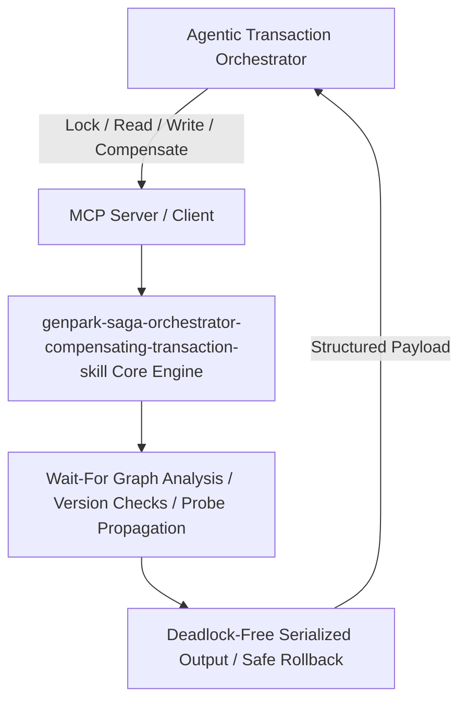

# genpark-saga-orchestrator-compensating-transaction-skill

[](https://github.com/alphaparkinc/genpark-saga-orchestrator-compensating-transaction-skill)
[](https://python.org)
[](#)
[](#)
[](LICENSE)

> Saga Pattern orchestrator coordinating forward steps across microservices and autonomous agents with automated compensating reverse rollbacks.

## Architecture Overview



## Features
- **0 External Pip Dependencies**: Pure Python standard library implementation.
- **MCP Protocol Ready**: Includes Model Context Protocol server script (`mcp_server.py`).
- **Production Standard**: ACID transaction compliance and rigorous distributed test cases.

## Quick Start
```bash
python example_usage.py
```
